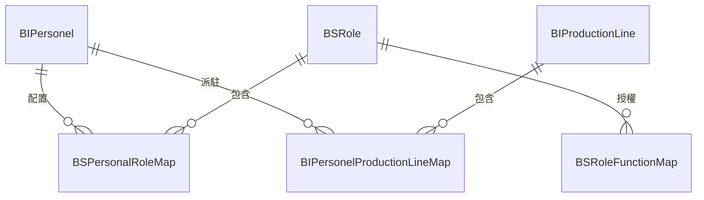
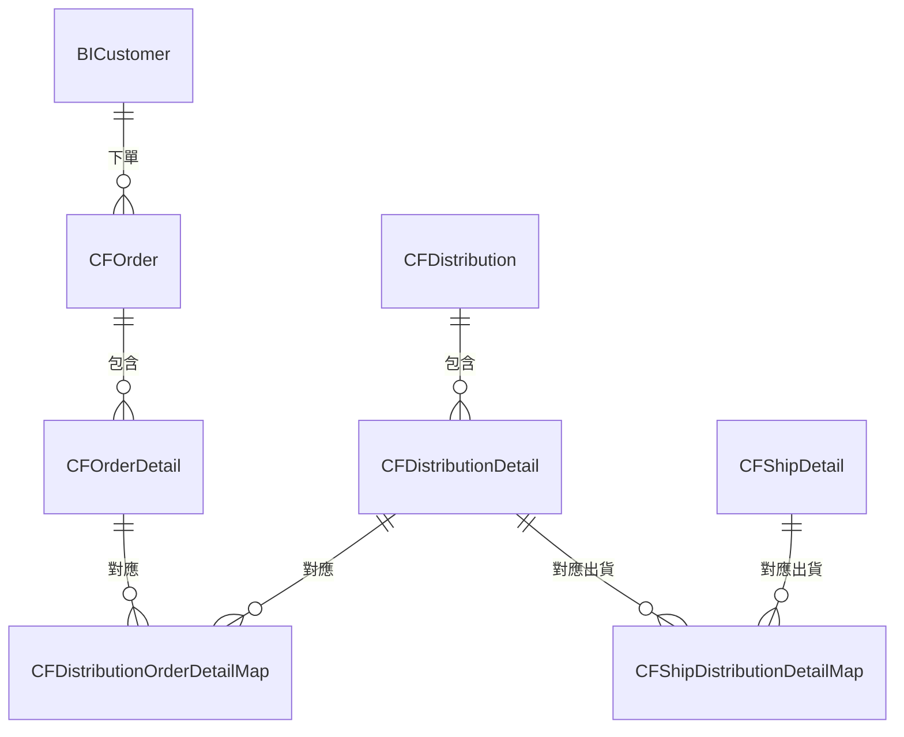

# PMM 資料庫實體關聯與進階查詢說明

本文件旨在補充基本查詢說明，針對 PMM 系統中各業務模組之間的核心關聯（Entity Relationships）進行深度剖析，協助開發與報表人員理解如何透過 `JOIN` 將各個散落的資料表串接起來，以應對更複雜的商業邏輯查詢。

---

## 一、 核心業務關聯架構

系統的資料主要透過幾項核心交易與設定串接。以下拆解四個主要的資料關聯鏈：

### 1. 人員、角色與產線關聯 (權限與基礎設定)
在系統設定中，人員（`BIPersonel`）不僅具備系統登入角色（`BSRole`），也同時從屬於特定的實體產線（`BIProductionLine`）。


**關聯邏輯：**
* 查詢某位人員的系統權限：`BIPersonel` -> `BSPersonalRoleMap` -> `BSRole` -> `BSRoleFunctionMap`
* 查詢某位人員可操作的產線：`BIPersonel` -> `BIPersonelProductionLineMap` -> `BIProductionLine`

### 2. 訂單、配貨與出貨的供需鏈 (以切花 CF 為例)
這是業務端最重要的關聯！需求單（訂單）不會直接出貨，而是先轉為「配貨單」，再由「配貨單」打包為「出貨單」。


* **盆花 (PP)** 的邏輯與此完全一致，只需將前綴 `CF` 換為 `PP`。

### 3. 調查作業關聯 (抽梗、點花、打荳)
針對農產品的品管，會有大量的調查明細綁定在特定的檢驗批次上：
* 切花抽梗：`CFSampleSurvey` (主檔) -> `CFSampleRecord` (總錄) -> `CFSampleDetail` (梗數明細)
* 盆花打荳：`PPBudSurvey` (主檔) -> `PPBudSurveyMap` (來源) -> `PPBudSurveyDetail` (明細)

### 4. 苗株與契約生產 (供應與初期)
* 契作進口：`SCUnderContract` (契作批次) 會延展至 `SCUnderContractVisit` (訪視紀錄)。
* 苗株批次：`YPPurchase` (進貨) 會轉入 `YPProductionBatch` (生產批次)，並且有獨立的 `YPPickingPlan` (挑苗排程)。

---

## 二、 進階查詢 SQL 實戰範例

### 範例一：查詢特定時段內「客戶切花訂單」到「實際出貨」的完整追蹤
此查詢跨越了 `需求單 -> 配貨關聯 -> 配貨單 -> 出貨關聯 -> 出貨單`。

```sql
SELECT 
    c.CustName AS 客戶名稱,
    o.OrderNo AS 訂單編號,
    od.Quantity AS 訂單需求量,
    d.DistributionNo AS 配貨單號,
    dd.DistQty AS 實際配貨量,
    s.ShipNo AS 出貨單號,
    sd.ShipQty AS 實際出貨量
FROM 
    CFOrder o
    INNER JOIN BICustomer c ON o.CustID = c.CustID
    INNER JOIN CFOrderDetail od ON o.OrderID = od.OrderID
    -- 串接配貨
    LEFT JOIN CFDistributionOrderDetailMap d_map ON od.DetailID = d_map.OrderDetailID
    LEFT JOIN CFDistributionDetail dd ON d_map.DistDetailID = dd.DetailID
    LEFT JOIN CFDistribution d ON dd.DistributionID = d.DistributionID
    -- 串接出貨
    LEFT JOIN CFShipDistributionDetailMap s_map ON dd.DetailID = s_map.DistDetailID
    LEFT JOIN CFShipDetail sd ON s_map.ShipDetailID = sd.DetailID
    LEFT JOIN CFShip s ON sd.ShipID = s.ShipID
WHERE 
    o.OrderDate >= '2026-05-01' AND o.OrderDate <= '2026-05-31'
ORDER BY 
    o.OrderDate DESC, c.CustName;
```

### 範例二：查詢盆花出貨時的包裝設定狀況
盆花出貨時，需要考慮包裝條件 (由 `PPOrderPackingSetting` 或 `PPShipPackingSetting` 判定)。

```sql
SELECT 
    ship.ShipNo AS 盆花出貨單號,
    sd.DetailID AS 出貨明細ID,
    pack.PackingColorID,
    c.ColorName AS 包裝顏色,
    pack.Quantity AS 包裝數量
FROM 
    PPShip ship
    INNER JOIN PPShipDetail sd ON ship.ShipID = sd.ShipID
    INNER JOIN PPShipPackingSetting pack ON sd.DetailID = pack.ShipTargetID
    LEFT JOIN BIPackingColor c ON pack.PackingColorID = c.ColorID
WHERE 
    ship.ShipDate = CAST(GETDATE() AS DATE);
```

### 範例三：人員操作權限總表
這是一支適用於報表，用來稽核「哪位員工擁有什麼系統模組權限」的查詢：

```sql
SELECT 
    p.Account AS 登入帳號,
    p.PersonelName AS 員工姓名,
    r.RoleName AS 角色名稱,
    rf.FunctionName AS 可用功能
FROM 
    BIPersonel p
    INNER JOIN BSPersonalRoleMap prm ON p.PersonelID = prm.PersonelID
    INNER JOIN BSRole r ON prm.RoleID = r.RoleID
    INNER JOIN BSRoleFunctionMap rf ON r.RoleID = rf.RoleID
WHERE 
    p.IsActive = 1
ORDER BY 
    p.Account, r.RoleName;
```

## 三、 查詢撰寫重點提示
1. **區分單頭與單身**：PMM的單據高度依照主檔/明細 (Header/Detail) 設計。主檔記載單號與客戶/建檔人工號，單身記載數量與參照料號 (如 `BreedID` 品種標識)。
2. **多對多關聯表**：為了支援「一張訂單分批配貨」或「多張訂單合併配貨」，在 Header/Detail 之間一定會有 `Map` 結尾的關聯表（例如 `CFDistributionOrderDetailMap`）。跨關聯查詢時請務必留意多對多造成的笛卡爾積 (Cartesian product，資料重複)，視情況需要使用 `GROUP BY` 搭配 `SUM()` 處理加總。